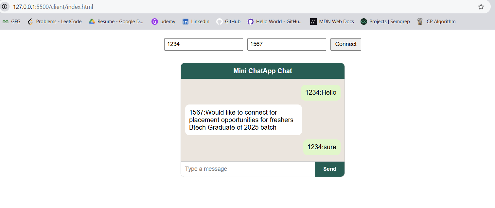
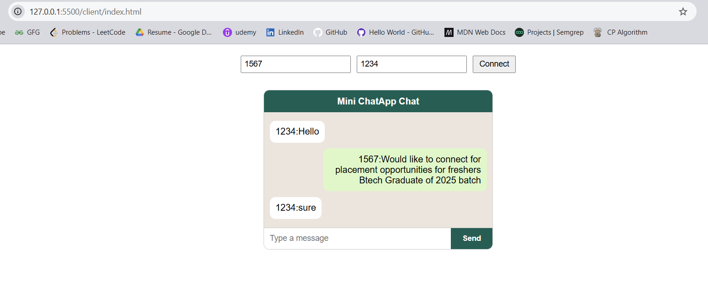

The WebChat application is the modern scalabel and distributed chat application using GoLang as the backend techstack and websocket concepts.

🗨️ WebChat — A Scalable Real-Time Chat Application

WebChat is a real-time chat application built with Golang using WebSockets to deliver instant, bidirectional communication between clients.
It’s designed with scalability and modularity in mind — capable of handling thousands of concurrent connections through an event-driven architecture.

⚠️ Note: This project is currently in active development. Features and structure may change as it evolves toward a production-ready release.

User 1 with ID 1234

User 2 with ID 1567

Features

✅ Real-Time Messaging — Users can send and receive messages instantly using WebSocket connections.
✅ Scalable Architecture — Designed to support horizontal scaling with Redis-based Pub/Sub for inter-instance communication.
✅ Multi-User Support — Multiple users can connect and chat in real time.
✅ Presence Tracking — Online/offline status management powered by Redis.
✅ Secure Connections — All messages are transmitted over wss:// (WebSocket Secure).
✅ Room & Direct Messaging (Planned) — Future support for chat rooms and private 1:1 messaging.
✅ Message Persistence (Planned) — Store chat history in PostgreSQL for message retrieval and replay.
✅ Typing Indicators & Read Receipts (Planned) — Enhance user experience with live feedback.
✅ Offline Notifications (Planned) — Push notifications when users are offline.